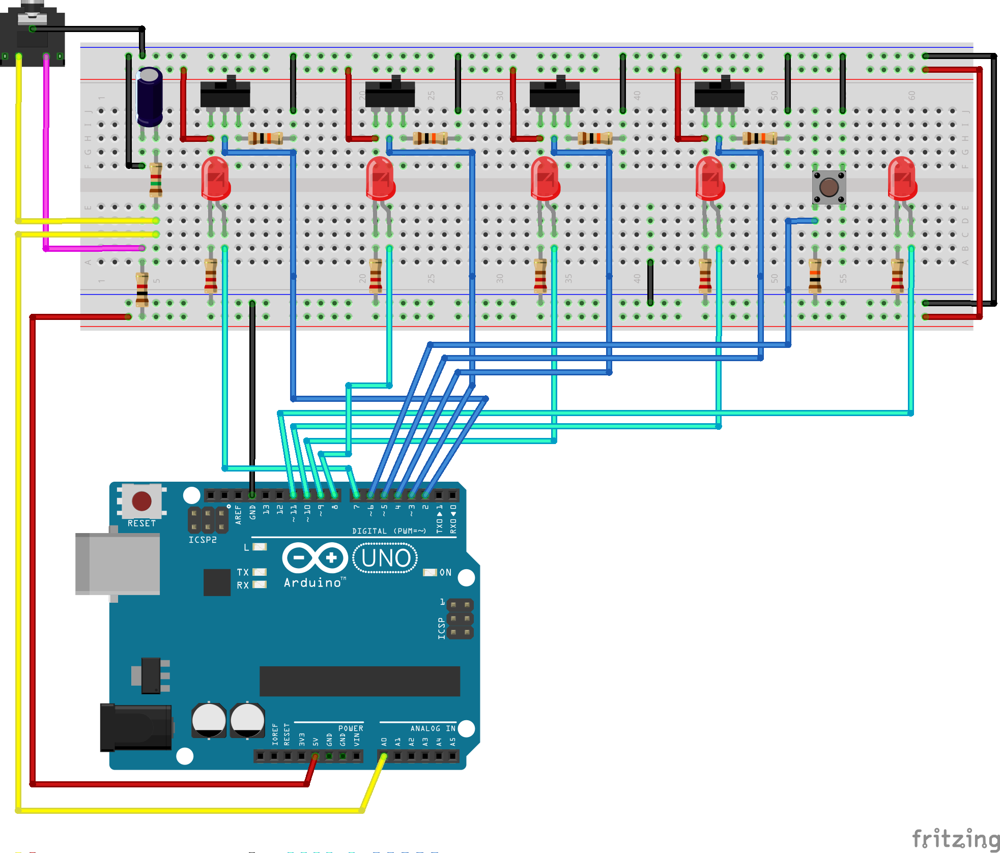
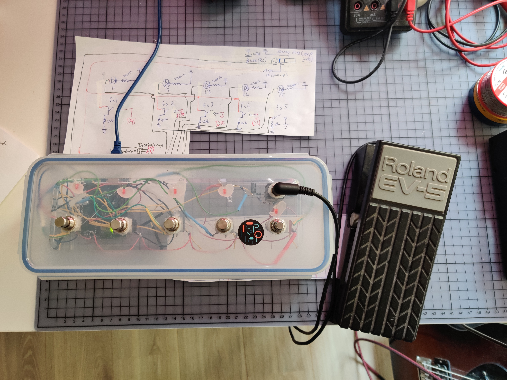

# simple_footController  
 
<strong>Parts:</strong>  
4x SPDT foot switch  
1x SPST foot switch  
5x LED  
5x 220&#8486; resistor  
5x 10k&#8486; resistor  
1x 1k&#8486; resistor  
1x 1,5k&#8486; resistor (<em>optional for RC LPF</em>)  
1x 4,7uF cap (<em>optional for RC LPF</em>)  
1x 3,5mm TRS audio connector (<em>optional for the expression pedal</em>)  
1x Arduino (I had UNO, but could be smaller models too)  
Wires, soldering tools and enclosure (I used one of the kitchen boxes).  
 

